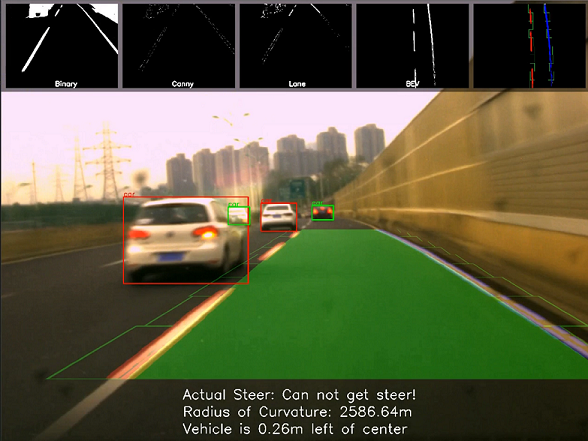

# Lane Follower
This code is for the lane follower, including perception and control, as shown below.

 

## Environment
1. Hardware
   * Industrial Camera
   * Intel-NUC(10FNK)
2. Software
   * Ubuntu18.04
   * Python3.6
   * OpenCV4.2
   * PyTorch1.8.1
   > See [environment.txt](./environment.txt) for details.

## How to use
### A. Offline Testing
The code supports the offline testing, which takes the offline video as input and output the demo video.

```
python offline_test.py
```

### B. OnLine Testing
The code also supports the online testing, which takes the real-time video streaming from the industrial camera as input and controls the vehicle.

```
python online_test.py
```
### C. Demo
You can find the offline testing video and the corresponding demo video [here](https://pan.baidu.com/s/1E4Zl6D0SnxghhAqise-Qtw) [n25o].



## Details
### Detailed structure


### Code Info

* [offline_test.py](./offline_test.py) --- Offline testing
  
* [online_test.py](./online_test.py) --- Online testing
  
* [basic_function](./basic_function.py) --- Some Basic Function
    * show_img(name, img): Show the image
    * find_files(directory, pattern): Method to find target files in one directory, including subdirectory
    * get_M_Minv(): Get Perspective Transform
    * draw_area(img_origin, img_line, Minv, left_fit, right_fit): Draw the road area in the image
    * draw_demo(img_result, img_bin, img_canny, img_line, img_line_warp, img_bev_result, curvature, distance_from_center, steer): Generate the Demo image

* [lib_camera](./lib_camera.py) --- Class for the industrial camera
    * open(): Open the camera
    * grab(): Grab an image from the camera
    * close(): Close the camera

* [mvsdk](./mvsdk.py) --- Official lib for the industrial camera 
  
* [lib_can](./lib_can.py) --- Class for the CAN
    * OpenDevice(): Open the CAN device
    * InitCAN(can_idx=0): Init the CAN
    * StartCan(can_idx=0): Start the CAN
    * Send(can_idx, id, frame_len, data): Send messages to CAN
    * Listen(can_idx, id, try_cnt=10): Receive messages from CAN
    * CloseDevice(): Close the CAN device

* [lib_LaneDetector](./lib_LaneDetector.py) --- Class for the lane detector
    * detect_line(img_input, steer, memory, debug=False): Main Function
    * pre_process(img, debug=False): Image Preprocessing
    * find_line(img, memory, debug=False): Detect the lane using Sliding Windows Methods
    * calculate_curv_and_pos(img_line, left_fit, right_fit): Calculate the curvature & distance from the center

* [lib_ObjectDetector](./lib_ObjectDetector.py) --- Class for the traffic object detector based on YOLO5
    * load_model(): Load Yolo5 model from pytorch hub
    * detect(frame, img_area): Predict and analyze using yolo5
    * class_to_label(idx): Return the corresponding string label for a given label value
    * plot_detections(results, frame): Takes a frame and its results as input, and plots the bounding boxes and label on to the frame

* [lib_vehicle](./lib_vehicle.py) --- Class for the vehicle model and vehicle control
    * steer_cal(curvature, dist_from_center): Calculate the steer according to the curvature of the lane and the distance form the center
    * steer_ctrl(): Control the steer by sending the signal via CAN
    * steer_get(): Get the real steer of the vehicle via the CAN

* libcontrolcan.so --- DLL for the CAN device
* libMVSDK.so --- DLL for the industrial camera

